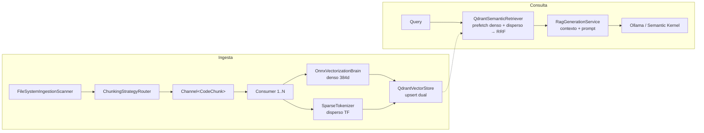

# Arquitectura

> Mapa de componentes, capas y contratos de RagEngine: qué hace cada pieza y por qué existe.

## Visión de conjunto

RagEngine es un motor RAG (Retrieval-Augmented Generation) **local** con dos flujos:

1. **Ingesta:** repositorio de código → chunks semánticos → vectores (denso + disperso) → Qdrant.
2. **Consulta:** pregunta en lenguaje natural → búsqueda híbrida con fusión RRF → contexto ensamblado → LLM local (Ollama) → respuesta citada.

## Capas y proyectos

| Proyecto | Rol |
|---|---|
| `RagEngine.Core` | Toda la lógica de negocio. Sin dependencias de UI. |
| `RagEngine.Cli` | Capa delgada de presentación: comandos Spectre.Console + configuración del host. |

Dentro de `RagEngine.Core`:

| Carpeta | Contenido |
|---|---|
| `Abstractions/` | Contratos: `IIngestionScanner`, `IVectorizationBrain`, `ISparseTokenizer`, `ISemanticRetriever`, `IIngestionPipeline`, `IRagGenerationService`, `IChunkingStrategy` |
| `Domain/` | Entidades: `CodeChunk`, `RetrievalResult`/`RetrievalOptions`, `IngestionRequest`/`Summary`/`Progress`, `ScanProfile`, `SourceLanguage` |
| `Infrastructure/Scanning` | `FileSystemIngestionScanner` — enumeración con perfiles de exclusión |
| `Infrastructure/Chunking` | Estrategias por lenguaje (Roslyn C#, TypeScript, Markdown, fallback) + router |
| `Infrastructure/Vectorization` | `OnnxVectorizationBrain` (denso) y `SparseTokenizer` (disperso) |
| `Infrastructure/VectorStore` | `QdrantVectorStore` (colecciones/upsert) y `QdrantSemanticRetriever` (búsqueda híbrida) |
| `Pipeline/` | `DefaultIngestionPipeline` (orquestador productor/consumidores) y `ContextAssembler` |
| `Services/Generation` | `RagGenerationService` — ensamblado de contexto + streaming del LLM |
| `Diagnostics/` | `RagEngineMetrics` (System.Diagnostics.Metrics) |

## Componentes del núcleo

### OnnxVectorizationBrain (denso)

Ejecuta `paraphrase-multilingual-MiniLM-L12-v2` in-process (ONNX Runtime, singleton por costo de inicialización). Soporta dos familias de tokenización mediante `OnnxTokenizerKind`:

- **WordPiece** (BERT, `vocab.txt`) — modelos monolingües como `all-MiniLM-L6-v2`.
- **SentencePiece** (XLM-R, `sentencepiece.bpe.model`) — modelos multilingües; los IDs crudos se remapean al espacio del modelo con la convención fairseq (`<s>=0, <pad>=1, </s>=2, <unk>=3`, pieza *i* → *i+1*).

Los inputs del grafo se construyen dinámicamente desde `InputMetadata` (algunos exports no llevan `token_type_ids`), el padding es **dinámico por lote** (hasta la secuencia más larga real), y la salida pasa por mean pooling + normalización L2. Detalle completo: [busqueda-hibrida.md](busqueda-hibrida.md).

### SparseTokenizer (disperso)

Vectores dispersos BM25-style calculados en C# puro, zero-allocation (spans + `AlternateLookup`). Aplica normalización léxica simétrica ES/EN (folding de acentos + stemming ligero) antes de hashear con MurmurHash3 a un espacio de 2²⁰ índices. Detalle: [busqueda-hibrida.md](busqueda-hibrida.md).

### QdrantVectorStore / QdrantSemanticRetriever

- El store gestiona colecciones con **esquema dual**: vector nombrado `dense` (coseno, 384d) + vector disperso `sparse-code`. Upserts idempotentes con `waitForCommit` configurable.
- El retriever ejecuta `QueryAsync` con dos `PrefetchQuery` (denso con `ScoreThreshold`, disperso sin umbral) fusionados por **RRF**, protegido por un pipeline Polly (retry exponencial + circuit breaker).

### DefaultIngestionPipeline

Productor (scan → chunk) y **N consumidores** (vectorizar → upsert) desacoplados por un `Channel` acotado (backpressure a 512 chunks). Detalle y números: [pipeline-de-ingesta.md](pipeline-de-ingesta.md).

### RagGenerationService

Ensambla el contexto (chunks rankeados, presupuesto de 12k chars, los chunks que no caben se **omiten sin truncar la cola**), construye un system prompt estricto de grounding (responde en el idioma de la pregunta; los atributos declarativos cuentan como reglas de negocio) y hace streaming desde Ollama vía Semantic Kernel.

## Decisiones de diseño clave

| Decisión | Racional |
|---|---|
| Modelo multilingüe con **mismos 384 dims** que el anterior | Cambio de modelo sin migración de esquema en Qdrant (sí requiere re-ingesta) |
| Variante **int8 ARM64** del modelo | 2.3× más rápida que fp32 con pérdida de calidad insignificante (coseno ES↔EN 0.91 vs 0.92) |
| Normalización dispersa **idéntica en ingesta y consulta** | El matching es hash exacto: la consistencia importa más que la precisión lingüística |
| `min-score` solo en el prefetch denso | Es la única rama cuyo score es una similitud acotada; los scores RRF son función del ranking |
| IDs de chunk deterministas (path + línea + hash de contenido) | Re-ingestas idempotentes, sin duplicados |
| Singleton para brain/tokenizer/cliente Qdrant; scoped para pipeline/retriever | Costo de inicialización vs. aislamiento por comando |

## Registro DI

Un único punto de composición: `ServiceCollectionExtensions.AddRagEngineCore(IConfiguration)`. Los hosts (CLI hoy, API mañana) permanecen delgados. Las estrategias de chunking se auto-descubren por reflexión sobre `IChunkingStrategy`.
