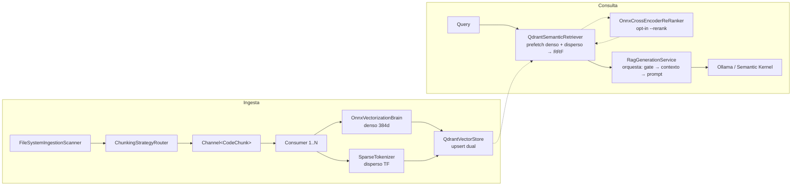

# Arquitectura

> Mapa de componentes, capas y contratos de RagEngine: qué hace cada pieza y por qué existe.

## Visión de conjunto

RagEngine es un motor RAG (Retrieval-Augmented Generation) **local** con dos flujos:

1. **Ingesta:** repositorio de código → chunks semánticos → vectores (denso + disperso) → Qdrant.
2. **Consulta:** pregunta en lenguaje natural → búsqueda híbrida con fusión RRF → contexto ensamblado → LLM local (Ollama) → respuesta citada.

## Capas y proyectos

| Proyecto | Rol |
|---|---|
| `RagEngine.Core` | Toda la lógica de negocio. Sin dependencias de UI. |
| `RagEngine.Cli` | Capa delgada de presentación: comandos Spectre.Console + configuración del host. |

Dentro de `RagEngine.Core`:

| Carpeta | Contenido |
|---|---|
| `Abstractions/` | Contratos: `IIngestionScanner`, `IVectorizationBrain`, `ISparseTokenizer`, `ISemanticRetriever`, `IReRanker`, `IIngestionPipeline`, `IRagGenerationService`, `IChunkingStrategy` |
| `Domain/` | Entidades: `CodeChunk`, `RetrievalResult`/`RetrievalOptions`, `IngestionRequest`/`Summary`/`Progress`, `ScanProfile`, `SourceLanguage` |
| `Infrastructure/Scanning` | `FileSystemIngestionScanner` — enumeración con perfiles de exclusión |
| `Infrastructure/Chunking` | Estrategias por lenguaje (Roslyn C#, TypeScript, Markdown, fallback) + router |
| `Infrastructure/Vectorization` | `OnnxVectorizationBrain` (denso) y `SparseTokenizer` (disperso) |
| `Infrastructure/VectorStore` | `QdrantVectorStore` (colecciones/upsert) y `QdrantSemanticRetriever` (búsqueda híbrida) |
| `Infrastructure/Reranking` | `OnnxCrossEncoderReRanker` — re-scoring opt-in del pool 3×TopK (`--rerank`) |
| `Pipeline/` | `DefaultIngestionPipeline` (orquestador productor/consumidores) y `ContextAssembler` |
| `Services/Generation` | `RagGenerationService` (orquestador) y sus colaboradores: `ConfidenceGate`, `GenerationContextAssembler`, `SystemPromptComposer`, `ChatAnswerStreamer`, `SimpleAnswerSanitizer`. Los textos de prompt viven en `Services/Generation/Prompts/` |
| `Diagnostics/` | `RagEngineMetrics` (System.Diagnostics.Metrics) |

## Componentes del núcleo

### OnnxVectorizationBrain (denso)

Ejecuta `paraphrase-multilingual-MiniLM-L12-v2` in-process (ONNX Runtime, singleton por costo de inicialización). Soporta dos familias de tokenización mediante `OnnxTokenizerKind`:

- **WordPiece** (BERT, `vocab.txt`) — modelos monolingües como `all-MiniLM-L6-v2`.
- **SentencePiece** (XLM-R, `sentencepiece.bpe.model`) — modelos multilingües; los IDs crudos se remapean al espacio del modelo con la convención fairseq (`<s>=0, <pad>=1, </s>=2, <unk>=3`, pieza *i* → *i+1*).

Los inputs del grafo se construyen dinámicamente desde `InputMetadata` (algunos exports no llevan `token_type_ids`), el padding es **dinámico por lote** (hasta la secuencia más larga real), y la salida pasa por mean pooling + normalización L2. Detalle completo: [busqueda-hibrida.md](busqueda-hibrida.md).

### SparseTokenizer (disperso)

Vectores dispersos BM25-style calculados en C# puro, zero-allocation (spans + `AlternateLookup`). Aplica normalización léxica simétrica ES/EN (folding de acentos + stemming ligero) antes de hashear con MurmurHash3 a un espacio de 2²⁰ índices. Detalle: [busqueda-hibrida.md](busqueda-hibrida.md).

### QdrantVectorStore / QdrantSemanticRetriever

- El store gestiona colecciones con **esquema dual**: vector nombrado `dense` (coseno, 384d) + vector disperso `sparse-code`. Upserts idempotentes con `waitForCommit` configurable.
- El retriever ejecuta `QueryAsync` con dos `PrefetchQuery` (denso con `ScoreThreshold`, disperso sin umbral) fusionados por **RRF**, protegido por un pipeline Polly (retry exponencial + circuit breaker).

### OnnxCrossEncoderReRanker (re-ranking, opt-in)

Con `--rerank`, el pool 3×TopK que la fusión RRF ya produce se re-puntúa candidato a candidato
contra la query original usando un Cross-Encoder multilingüe (`mmarco-mMiniLMv2-L12-H384-v1`,
mismo tokenizador SentencePiece/XLM-R que el bi-encoder). El `InferenceSession` es `Lazy<T>`:
solo se instancia si alguna búsqueda pide re-ranking, así que no tener el modelo descargado no
afecta al flujo por defecto. El score resultante (sigmoide del logit) reemplaza al RRF en
`RetrievalResult.SimilarityScore` — son escalas distintas, no comparables. Detalle:
[busqueda-hibrida.md](busqueda-hibrida.md#re-ranking-cross-encoder--onnxcrossencoderreranker).

### DefaultIngestionPipeline

Productor (scan → chunk) y **N consumidores** (vectorizar → upsert) desacoplados por un `Channel` acotado (backpressure a 512 chunks). Detalle y números: [pipeline-de-ingesta.md](pipeline-de-ingesta.md).

### RagGenerationService y sus colaboradores

`RagGenerationService` **sólo orquesta**: encadena los pasos del turno y decide el camino. El
trabajo de cada paso vive en una clase con una responsabilidad. La separación es del ítem 2.2 del
plan de ingeniería; antes las seis vivían en un archivo de 680 líneas, y tocar una obligaba a leer
las otras cinco.

| Paso | Clase | Qué hace |
|---|---|---|
| 0 | `SemanticMetaIntentDetector` | Corta antes de buscar si la pregunta es sobre el propio asistente |
| 1 | `ISemanticRetriever` | Recupera el top-K (el servicio sólo envuelve el `try/catch`) |
| 2 | `ConfidenceGate` | Decide la banda: sin anclaje, banda media (con matiz) o banda alta |
| 3 | `GenerationContextAssembler` | Resuelve el contenido de cada chunk y arma el bloque de contexto |
| 4 | `SystemPromptComposer` | Elige la plantilla (código / documentos / Simple) y la compone |
| 5 | `ChatAnswerStreamer` | Única pieza que toca el `Kernel`; emite los fragmentos |
| 6 | `SimpleAnswerSanitizer` | Filtro determinista posterior, sólo en modo Simple |

Detalles que no son obvios y conviene no re-descubrir:

- **Presupuesto de contexto:** 12k caracteres. Los chunks que no caben se **omiten sin truncar la
  cola** — un chunk gigante a mitad del ranking no descarta a los que vienen detrás. El número de
  chunk en la cabecera se incrementa igual, así que la numeración refleja el ranking, no lo que entró.
- **El gate corta de verdad:** cuando `ConfidenceGate` dice que no hay anclaje, los chunks
  recuperados **no se vuelven a tocar**; se conversa sin contexto. Es garantía estructural, no una
  instrucción al modelo — ver
  [guardrail-banda-baja-conversacional.md](analisis-futuro/guardrail-banda-baja-conversacional.md).
- **Modo Simple no puede hacer streaming token a token:** el sanitizador necesita el texto completo
  para casar cercas e identificadores que se abren y cierran en fragmentos distintos, así que ese
  camino bufferiza. Los demás emiten según llegan.
- **Los umbrales se leen por turno** vía `IOptionsMonitor`, para que la bandera de rollback surta
  efecto con un reinicio y sin recompilar.
- **Los logs del turno ya no salen todos bajo una misma categoría.** Cada colaborador registra con
  la suya (`…Generation.ConfidenceGate`, `…Generation.ChatAnswerStreamer`,
  `…Generation.GenerationContextAssembler`), no bajo `…Generation.RagGenerationService` como antes
  de partir la clase. El filtro `"RagEngine": "Information"` de `appsettings.json` las cubre todas;
  un filtro escrito contra el nombre completo del servicio, no.

**Cómo se prueba que no cambió nada al partirlo:** `GenerationContextGoldenTests` compara el bloque
de contexto byte a byte y la plantilla elegida contra un golden capturado ejecutando el código
**previo** a la descomposición (`tests/RagEngine.Core.Tests/GoldenMaster/generacion-contexto.json`).
Los textos de prompt los cubre aparte `PromptHashesTests`.

## Decisiones de diseño clave

| Decisión | Racional |
|---|---|
| Modelo multilingüe con **mismos 384 dims** que el anterior | Cambio de modelo sin migración de esquema en Qdrant (sí requiere re-ingesta) |
| Variante **int8 ARM64** del modelo | 2.3× más rápida que fp32 con pérdida de calidad insignificante (coseno ES↔EN 0.91 vs 0.92) |
| Normalización dispersa **idéntica en ingesta y consulta** | El matching es hash exacto: la consistencia importa más que la precisión lingüística |
| `min-score` solo en el prefetch denso | Es la única rama cuyo score es una similitud acotada; los scores RRF son función del ranking |
| Re-ranker con carga perezosa (`Lazy<T>`) | `--rerank` es opt-in; exigir el modelo cross-encoder al arrancar rompería el flujo por defecto sin ganancia |
| IDs de chunk deterministas (path + línea + hash de contenido) | Re-ingestas idempotentes, sin duplicados |
| Singleton para brain/tokenizer/cliente Qdrant; scoped para pipeline/retriever | Costo de inicialización vs. aislamiento por comando |

## Registro DI

Un único punto de composición: `ServiceCollectionExtensions.AddRagEngineCore(IConfiguration)`. Los hosts (CLI hoy, API mañana) permanecen delgados. Las estrategias de chunking se auto-descubren por reflexión sobre `IChunkingStrategy`.
