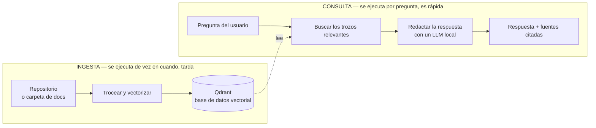
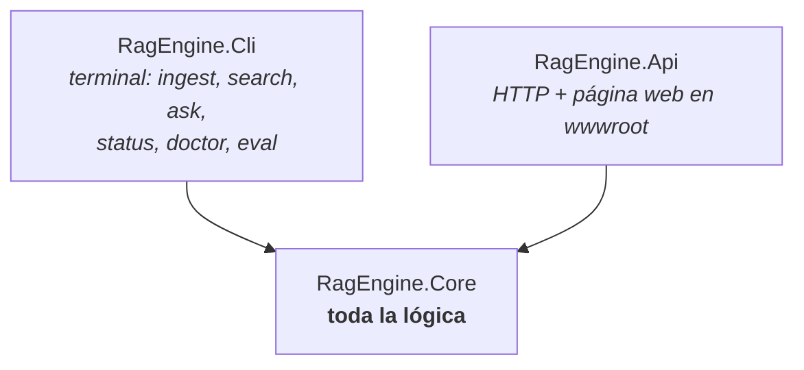
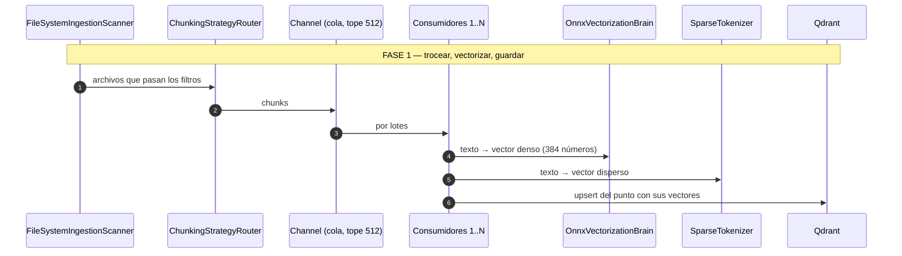
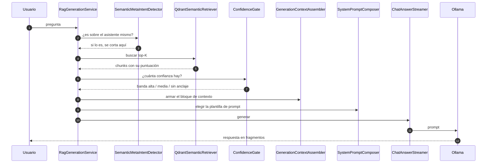
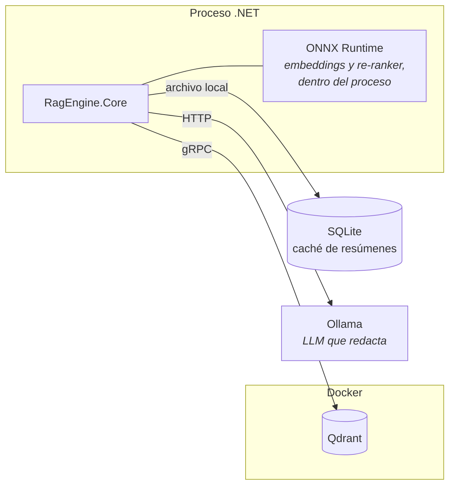

# Cómo funciona RagEngine

> Recorrido explicado del sistema tal como está construido hoy, para quien se incorpora al proyecto.
> Describe el código que existe: cada pieza que se nombra está en el repositorio y se cita su ruta.
> Para el detalle técnico de cada área, los enlaces del final.

## Qué asume este documento

Que sabes C# y que has visto una API web, pero **no** que conozcas motores de búsqueda ni modelos de
lenguaje. El vocabulario se explica en la sección 2.

## 1. Qué hace el sistema

RagEngine responde preguntas en lenguaje natural sobre un repositorio de código o un conjunto de
documentos, citando de dónde sacó la respuesta. Funciona **en local**: ni el contenido ni las
preguntas salen de la máquina.

Tiene dos flujos, y conviene no mezclarlos nunca al razonar sobre un problema:

**La ingesta escribe; la consulta lee.** Si una respuesta es mala, la causa está en uno de los dos y
son diagnósticos distintos: o el trozo correcto nunca se indexó bien (ingesta), o se indexó pero la
búsqueda no lo encontró o el modelo no lo usó (consulta).

## 2. Vocabulario mínimo

| Término | Qué es aquí |
|---|---|
| **Chunk** | Un trozo de un archivo. No se indexa el archivo entero: se parte en piezas con sentido propio (un método, una clase, una sección de Markdown). El tipo es `Domain/CodeChunk.cs`. |
| **Colección** | El conjunto indexado de un proyecto, dentro de Qdrant. Se elige por nombre al ingestar y al consultar. |
| **Vector denso** | Una lista de 384 números que representa el *significado* de un texto. Dos textos que quieren decir lo mismo tienen vectores parecidos, aunque no compartan ni una palabra. Lo produce `Infrastructure/Vectorization/OnnxVectorizationBrain.cs`. |
| **Vector disperso** | Una representación basada en las *palabras exactas* del texto. Encuentra lo que el denso no: un nombre de clase, un identificador raro. Lo produce `Infrastructure/Vectorization/SparseTokenizer.cs`. |
| **Búsqueda híbrida** | Buscar por los dos a la vez y combinar los resultados. Es lo que hace `QdrantSemanticRetriever`. |
| **RRF** | La fórmula que combina las dos listas de resultados. Mezcla por **posición** en cada lista, no por puntuación, así que no hace falta que las dos escalas sean comparables. |
| **Re-ranking** | Un segundo modelo, más caro y más preciso, que reordena los candidatos que ya salieron. Opcional (`--rerank`). Es `Infrastructure/Reranking/OnnxCrossEncoderReRanker.cs`. |
| **Resumen de negocio** | Una descripción en lenguaje natural de qué hace un chunk, generada por un LLM durante la ingesta. Sirve para que una pregunta de negocio ("¿cómo se aprueba una auditoría?") encuentre código que no usa esas palabras. |
| **Banda de confianza** | La decisión de cuánto se fía el sistema de lo que encontró: alta, media o sin anclaje. La toma `Services/Generation/ConfidenceGate.cs` y determina cómo se le habla al modelo. |

## 3. Los tres proyectos

| Proyecto | Qué contiene |
|---|---|
| `RagEngine.Core` | Todo el trabajo real. No sabe si lo llaman desde una terminal o desde HTTP. |
| `RagEngine.Cli` | Comandos de terminal con Spectre.Console: `ingest`, `search`, `status`, `ask`, `doctor`, `eval` (`Cli/Program.cs:74-101`). |
| `RagEngine.Api` | Endpoints `/api/health`, `/api/collections`, `/api/search`, `/api/ask`, `/api/ask/stream`, `/api/test-metrics`, y una página en `wwwroot/index.html`. |

Los dos hosts arrancan igual: llaman a `AddRagEngineCore` y `AddRagEngineGeneration`
(`Extensions/ServiceCollectionExtensions.cs`, `Extensions/GenerationServiceExtensions.cs`). Ahí se
registra quién implementa qué; ninguno de los dos duplica ese cableado.

## 4. Cómo está organizado el núcleo

Cuatro carpetas, y la distinción entre las dos primeras es la que más ayuda a orientarse:

| Carpeta | Qué hay | Cómo reconocerla |
|---|---|---|
| `Abstractions/` | **Interfaces.** Qué se puede pedir, sin decir cómo se hace. | Todo empieza por `I`: `ISemanticRetriever`, `IVectorizationBrain`, `IReRanker`, `IChunkingStrategy`… |
| `Infrastructure/` | **Implementaciones que hablan con algo externo:** Qdrant, ONNX, el disco. | Los nombres dicen con qué hablan: `QdrantSemanticRetriever`, `OnnxVectorizationBrain`, `FileSystemIngestionScanner`. |
| `Domain/` | Los tipos que se pasan entre piezas: `CodeChunk`, `RetrievalResult`, `SourceLanguage`. | No dependen de nada externo. |
| `Services/` y `Pipeline/` | Los **orquestadores**: encadenan los pasos y deciden el camino. | `DefaultIngestionPipeline`, `RagGenerationService`. |

Regla práctica para leer el código: si buscas **qué** hace falta, mira `Abstractions/`; si buscas
**cómo** se hace, busca en `Infrastructure/` la clase cuyo nombre empieza por la tecnología.

## 5. Recorrido de una ingesta (`rag ingest`)

Lo orquesta `Pipeline/DefaultIngestionPipeline.cs`. Son dos fases con propósitos distintos.

**Paso a paso:**

1. **Escanear.** `FileSystemIngestionScanner` recorre la carpeta aplicando exclusiones
   (`Infrastructure/Scanning/IgnoreRules.cs`): no entra en `bin/`, `obj/`, `node_modules/` y demás.
2. **Trocear.** `ChunkingStrategyRouter` elige cómo partir cada archivo según su lenguaje. Hay tres
   estrategias dedicadas y una de reserva:

   | Estrategia | Para qué lenguaje |
   |---|---|
   | `RoslynCSharpChunkingStrategy` | C# — usa el compilador de verdad para cortar por método y clase |
   | `TypeScriptChunkingStrategy` | TypeScript |
   | `MarkdownChunkingStrategy` | Markdown — corta por secciones |
   | `FallbackChunkingStrategy` | **Todo lo demás** (`SourceLanguage.Unknown`): JavaScript, XAML, SQL, texto plano |

3. **Encolar.** Los chunks pasan por un `Channel` con tope de 512. Ese tope es lo que impide que el
   troceado, que es rápido, se coma la memoria mientras la vectorización, que es lenta, va detrás.
4. **Vectorizar y guardar.** Varios consumidores en paralelo convierten cada lote en sus dos vectores
   y lo escriben en Qdrant. El **id de cada punto se calcula del contenido**
   (`Utilities/DeterministicGuid.cs`, `Utilities/ContentHasher.cs`), así que volver a ingestar lo
   mismo sobrescribe en vez de duplicar.

**Fase 2 — resúmenes de negocio** (opcional, `DefaultIngestionPipeline.cs:397` en adelante). Va
aparte porque llamar a un LLM por cada chunk es órdenes de magnitud más lento que vectorizar. Los
puntos quedan marcados en Qdrant con `resumen_pending=true`, y la fase 2 los recorre desde ahí — no
desde una lista en memoria — de modo que una corrida interrumpida se reanuda donde estaba. Lo que
genera se guarda en una caché SQLite (`Services/Summary/SummaryCache.cs`) para no volver a pagarlo.

**Cuántos vectores tiene una colección.** Dos siempre (`dense`, `sparse-code`) y un tercero
(`dense-resumen`) sólo si se corrió la fase 2. Los nombres están en
`QdrantVectorStore.cs:17-21`. Esto importa en la consulta, ver el paso 2 del siguiente recorrido.

## 6. Recorrido de una pregunta (`rag ask` o `/api/ask`)

Lo orquesta `Services/Generation/RagGenerationService.cs`, que **sólo encadena pasos**: el trabajo de
cada uno vive en una clase aparte.

**Los siete pasos, con lo que hay que saber de cada uno:**

| # | Clase | Qué hace |
|---|---|---|
| 0 | `SemanticMetaIntentDetector` | Detecta preguntas sobre el propio asistente ("¿qué puedes hacer?") y corta **antes** de buscar. |
| 1 | `QdrantSemanticRetriever` | Busca. Ver abajo. |
| 2 | `ConfidenceGate` | Decide la banda de confianza. |
| 3 | `GenerationContextAssembler` | Arma el texto que se le pasa al modelo. |
| 4 | `SystemPromptComposer` | Elige la plantilla: código, documentos o modo Simple. Los textos están en `Services/Generation/Prompts/`. |
| 5 | `ChatAnswerStreamer` | **Única pieza que habla con el LLM.** |
| 6 | `SimpleAnswerSanitizer` | Filtro final, sólo en modo Simple. |

**Sobre el paso 1 — la búsqueda tiene dos caminos**, y depende de la colección
(`QdrantSemanticRetriever.cs:95`): si tiene el tercer vector `dense-resumen`, se usa una fusión RRF
ponderada escrita a mano (pesos en la sección `RetrievalFusion` de la configuración); si sólo tiene
dos, se usa la fusión RRF nativa de Qdrant. Con `--rerank` se añade después el paso del
cross-encoder.

**Sobre el paso 2 — el gate corta de verdad.** Cuando `ConfidenceGate` dice que no hay anclaje, los
chunks recuperados **no se vuelven a tocar**: se conversa sin contexto. No es una instrucción al
modelo que el modelo pueda ignorar; es que el contexto no se le entrega.

**Sobre el paso 3 — el presupuesto de contexto es de 12.000 caracteres.** Los chunks que no caben se
omiten, pero **no se corta la cola**: un chunk enorme a mitad del ranking no descarta a los que
vienen detrás.

**Sobre el paso 5 — el modo Simple no puede emitir token a token.** El sanitizador del paso 6
necesita el texto completo para casar cercas de código e identificadores que se abren y cierran en
fragmentos distintos, así que ese camino espera a tenerlo todo. Los demás emiten según llegan.

## 7. Qué se ejecuta dónde

Los modelos de embeddings y de re-ranking corren **dentro del proceso .NET** vía ONNX Runtime: no
hay servicio aparte que arrancar. El LLM que redacta la respuesta sí es externo (Ollama), y Qdrant
corre en Docker (`infra/docker-compose.yml`).

## 8. Dónde tocar según lo que quieras cambiar

| Quiero… | Mira en |
|---|---|
| Cambiar cómo se parte un lenguaje | `Infrastructure/Chunking/` — la estrategia de ese lenguaje |
| Añadir un lenguaje con troceado propio | `Domain/SourceLanguage.cs` + una nueva `IChunkingStrategy` (el router la descubre sola) |
| Cambiar qué archivos se ignoran | `Infrastructure/Scanning/IgnoreRules.cs` |
| Cambiar cómo se combinan las búsquedas | `Infrastructure/VectorStore/QdrantSemanticRetriever.cs` y los pesos de `RetrievalFusion` |
| Cambiar el texto de un prompt | `Services/Generation/Prompts/` — están fuera del código a propósito |
| Cambiar cuándo el sistema dice "no tengo evidencia" | `Services/Generation/ConfidenceGate.cs` y los umbrales de `RagGeneration` |
| Cambiar un valor sin recompilar | `appsettings.json` — ver [configuracion.md](configuracion.md) |
| Saber si algo está mal montado | `rag doctor` |

**Aviso que ahorra días:** cambiar el modelo de embeddings o cómo se trocea **invalida lo ya
indexado** y obliga a re-ingestar la colección entera. Cambiar prompts, umbrales o pesos de fusión,
no. La matriz completa de "cuándo hay que re-ingestar" está en
[configuracion.md](configuracion.md), y el procedimiento en [reingesta-manual.md](reingesta-manual.md).

## 9. Para seguir

| Documento | Qué añade sobre lo de aquí |
|---|---|
| [arquitectura.md](arquitectura.md) | Los mismos componentes en formato de referencia, con las decisiones de diseño y su racional |
| [busqueda-hibrida.md](busqueda-hibrida.md) | Cómo funcionan por dentro el vector denso, el disperso y la fusión |
| [pipeline-de-ingesta.md](pipeline-de-ingesta.md) | La ingesta en detalle, con los números de rendimiento medidos |
| [guia-cli.md](guia-cli.md) | Cada comando con sus opciones y ejemplos |
| [operaciones.md](operaciones.md) | Qdrant, caché, logs, métricas y runbook de problemas conocidos |
