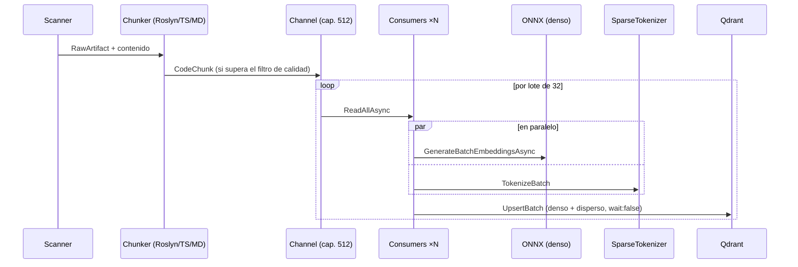

# Pipeline de ingesta

> Del repositorio a Qdrant: flujo productor/consumidores, estrategias de chunking, filtros de calidad y rendimiento medido.

## Flujo

## Concurrencia

- **Productor único** (scan + chunking) y **2–4 consumidores** (`Clamp(ProcessorCount/4, 2, 4)`) compitiendo por el mismo `Channel` acotado (512, backpressure por diseño): mientras un consumidor espera el upsert de Qdrant, otro está en inferencia ONNX. Sin esto, la latencia del upsert dual entra íntegra a la ruta crítica entre lote y lote.
- Dentro de cada lote, la vectorización **densa y dispersa corren en paralelo** (`Task.WhenAll`); la dispersa cuesta ~1 ms/lote y nunca es el cuello de botella.
- **`wait: false` en upserts de ingesta masiva:** Qdrant confirma al persistir en el WAL (durabilidad garantizada) y aplica los índices asíncronamente, sacando ~300 ms/lote de la ruta crítica.
- Errores aislados por artefacto y por lote: un archivo malformado o un upsert fallido se registran y el pipeline continúa.

## Chunking

`ChunkingStrategyRouter` elige la estrategia por lenguaje; el fallback es ventana deslizante.

**RoslynCSharpChunkingStrategy** (la principal) genera por cada tipo:

| Chunk | Contenido |
|---|---|
| `Class` | **Listas de atributos completas** + declaración (modificadores, identificador, base list) + campos — reconstruido desde el AST, no desde texto plano |
| `Constructor` / `Method` | Texto completo del miembro; métodos grandes se parten en ventana deslizante con solape |
| `Property` | Todas las propiedades agrupadas, **con sus atributos** (`[RuleRequiredField]`, etc.) |

Cada chunk lleva un `EnrichedContent` = encabezado estructural (`// Repository / File / Namespace / class / method`) + contenido — es lo que se vectoriza, y mejora sustancialmente los embeddings.

> **Importante para corpus tipo XAF/DevExpress:** las reglas de negocio viven en atributos declarativos sobre clases y propiedades. Los chunks `Class` y `Property` los preservan íntegros; una versión anterior los descartaba (ver historial del bug en `git log -- RoslynCSharpChunkingStrategy.cs`).

## Filtro de calidad — contenido mínimo indexable

Chunks con contenido `< 60` chars **no se indexan**: constructores boilerplate de una línea, interfaces marcador, cáscaras `public static class X`. No contienen información respondible, pero su `EnrichedContent` —casi puro encabezado con el nombre de la entidad— produce embeddings artificialmente cercanos a cualquier consulta que mencione esa entidad, contaminando el ranking de ambas ramas. En un corpus real de 21k chunks, el filtro eliminó ~1,100 cáscaras (5%).

## Rendimiento medido

Hardware de referencia: Apple Silicon, Qdrant local en Docker, modelo int8 ARM64, batch 32.

| Corpus | Chunks | Duración | Nota |
|---|---|---|---|
| RagEngine (este repo, 57 archivos) | ~430 | **~4 s** | |
| BusinessSuite.Xaf (2,148 archivos) | ~20,000 | **2m 26s** | Antes de la paralelización y con el modelo monolingüe: 4m 21s |

El costo dominante es la inferencia ONNX (~150 ms/lote int8). Palancas si se necesita más:
`BatchSize` mayor, `MaxSequenceLength` menor (trunca chunks largos), o volver al modelo monolingüe L6 (≈2× más rápido, sin español).

## Idempotencia y re-ingesta

- IDs deterministas (`path + línea + hash de contenido`): re-ejecutar `ingest` sobre el mismo estado no duplica puntos.
- `--force` borra y recrea la colección (pide confirmación interactiva).
- La matriz de "qué cambios exigen re-ingestar" está en [configuracion.md](configuracion.md#cuándo-re-ingestar).
