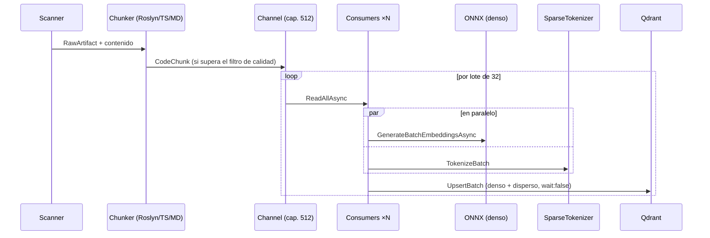

# Pipeline de ingesta

> Del repositorio a Qdrant: flujo productor/consumidores, estrategias de chunking, filtros de calidad y rendimiento medido.

## Flujo

## Concurrencia

- **Productor único** (scan + chunking) y **2–4 consumidores** (`Clamp(ProcessorCount/4, 2, 4)`) compitiendo por el mismo `Channel` acotado (512, backpressure por diseño): mientras un consumidor espera el upsert de Qdrant, otro está en inferencia ONNX. Sin esto, la latencia del upsert dual entra íntegra a la ruta crítica entre lote y lote.
- Dentro de cada lote, la vectorización **densa y dispersa corren en paralelo** (`Task.WhenAll`); la dispersa cuesta ~1 ms/lote y nunca es el cuello de botella.
- **`wait: false` en upserts de ingesta masiva:** Qdrant confirma al persistir en el WAL (durabilidad garantizada) y aplica los índices asíncronamente, sacando ~300 ms/lote de la ruta crítica.
- Errores aislados por artefacto y por lote: un archivo malformado o un upsert fallido se registran y el pipeline continúa.

## Chunking

`ChunkingStrategyRouter` elige la estrategia por lenguaje; el fallback es ventana deslizante.

**RoslynCSharpChunkingStrategy** (la principal) genera por cada tipo:

| Chunk | Contenido |
|---|---|
| `Class` | **Listas de atributos completas** + declaración (modificadores, identificador, base list) + campos — reconstruido desde el AST, no desde texto plano |
| `Constructor` / `Method` | Texto completo del miembro; métodos grandes se parten en ventana deslizante con solape |
| `Property` | Todas las propiedades agrupadas, **con sus atributos** (`[RuleRequiredField]`, etc.) |

Cada chunk lleva un `EnrichedContent` = encabezado estructural (`// Repository / File / Namespace / class / method`) + contenido — es lo que se vectoriza, y mejora sustancialmente los embeddings.

> **Importante para corpus tipo XAF/DevExpress:** las reglas de negocio viven en atributos declarativos sobre clases y propiedades. Los chunks `Class` y `Property` los preservan íntegros; una versión anterior los descartaba (ver historial del bug en `git log -- RoslynCSharpChunkingStrategy.cs`).

## Exclusiones del corpus — `.gitignore` y `.ragignore`

`IgnoreRules` (`Infrastructure/Scanning/IgnoreRules.cs`) carga, de la raíz del repositorio que se
escanea, dos archivos con sintaxis `.gitignore`:

| Archivo | Para qué |
|---|---|
| `.gitignore` | Lo que el repo ya declara como "no es fuente" (`bin/`, `obj/`, `logs/`, artefactos de build) tampoco es corpus. Se respeta tal cual, sin duplicar la lista a mano. |
| `.ragignore` | Exclusiones propias del corpus: archivos **versionados y legítimos** que aun así no aportan a la búsqueda semántica — baselines de evaluación, volcados generados por máquina, datos de prueba. |

Se aplica `.ragignore` después, así que puede re-incluir con `!patrón` algo que `.gitignore`
excluye. Soporta comentarios, negación, anclaje a la raíz (`/build` o cualquier patrón con `/`
intermedia), coincidencia a cualquier nivel (`logs`), sólo-directorio (`logs/`), `*` y `?` que no
cruzan separador, `**` que sí, y **gana la última regla que coincide**.

La pertenencia a un directorio excluido se resuelve comprobando los ancestros de cada ruta, no
haciendo que el patrón absorba descendientes: así `logs/` excluye `logs/a/b.json` sin que un patrón
de archivo se coma medio árbol por accidente. El escáner poda directorios enteros para no recorrer
lo que ya sabe que no entra, pero **desactiva la poda si hay alguna negación**: algo de dentro
podría estar re-incluido y hay que bajar a comprobarlo archivo a archivo.

> Por qué existe: `logs/` llevaba en el `.gitignore` de este repo desde `ba70ec1` y aun así se
> indexaba — 37 puntos de telemetría de consultas compitiendo en el retrieval con el código. El
> escáner sólo sabía excluir por nombre exacto de directorio contra una lista fija en `ScanProfile`,
> que sigue existiendo como piso mínimo (`bin`, `obj`, `node_modules`, …) para repos sin git.

Efecto medido sobre este mismo repo al excluir la salida de máquina del arnés de evaluación:
170 → 148 archivos, 1.566 → 1.286 chunks (**−18 %**).

## Filtro de calidad — contenido mínimo indexable

Chunks con contenido `< 60` chars **no se indexan**: constructores boilerplate de una línea, interfaces marcador, cáscaras `public static class X`. No contienen información respondible, pero su `EnrichedContent` —casi puro encabezado con el nombre de la entidad— produce embeddings artificialmente cercanos a cualquier consulta que mencione esa entidad, contaminando el ranking de ambas ramas. En un corpus real de 21k chunks, el filtro eliminó ~1,100 cáscaras (5%).

## Rendimiento medido

Hardware de referencia: Apple Silicon, Qdrant local en Docker, modelo int8 ARM64, batch 32.

| Corpus | Chunks | Duración | Nota |
|---|---|---|---|
| RagEngine (este repo, 57 archivos) | ~430 | **~4 s** | |
| BusinessSuite.Xaf (2,148 archivos) | ~20,000 | **2m 26s** | Antes de la paralelización y con el modelo monolingüe: 4m 21s |

El costo dominante es la inferencia ONNX (~150 ms/lote int8). Palancas si se necesita más:
`BatchSize` mayor, `MaxSequenceLength` menor (trunca chunks largos), o volver al modelo monolingüe L6 (≈2× más rápido, sin español).

## Idempotencia y re-ingesta

- **IDs deterministas**: `UUIDv5(rutaAbsoluta:startLine:hashContenido)`. Re-ejecutar `ingest` sobre
  el mismo estado no duplica puntos — verificado chunkeando este corpus cuatro veces en dos
  procesos distintos: 22.592 chunks, Ids byte-idénticos.
- **Limpieza de obsoletos**: como el Id depende de la línea inicial y del contenido, editar un
  archivo produce Ids nuevos y dejaba los viejos indexados para siempre. Al cerrar la Fase 1,
  `DeleteSupersededPointsAsync` borra los puntos cuyo archivo **sí** se acaba de procesar y cuyo Id
  ya no está entre los chunks vigentes. Se reporta en la línea de cierre como `Obsoletos borrados`.
  - Se limita a archivos efectivamente procesados: uno que la Fase 1 se saltó por error de lectura
    o de chunking conserva sus puntos, para que un fallo transitorio no borre datos buenos.
  - **No** cubre archivos borrados del repo ni rutas recién excluidas: esos casos necesitan `--force`.
  - No corre con `--force`, donde la colección se acaba de recrear.
  - Es la implementación del `OrphanChunkCleaner` que el diseño original especificaba como
    mitigación del riesgo R5 (`Fase 5 - Evaluación de Riesgos y Mitigación.md`).
- **Guarda de fallo ruidoso**: si la Fase 1 generó chunks y Qdrant no aceptó ninguno, la ingesta
  aborta. Antes registraba `Ingestion complete. Indexed: 0` y salía con éxito, dejando la colección
  silenciosamente sin actualizar.
- `--force` borra y recrea la colección; **`--yes`** confirma sin preguntar (obligatorio sin TTY).
- La matriz de "qué cambios exigen re-ingestar" está en [configuracion.md](configuracion.md#cuándo-re-ingestar);
  los comandos concretos por colección, en [reingesta-manual.md](reingesta-manual.md).
